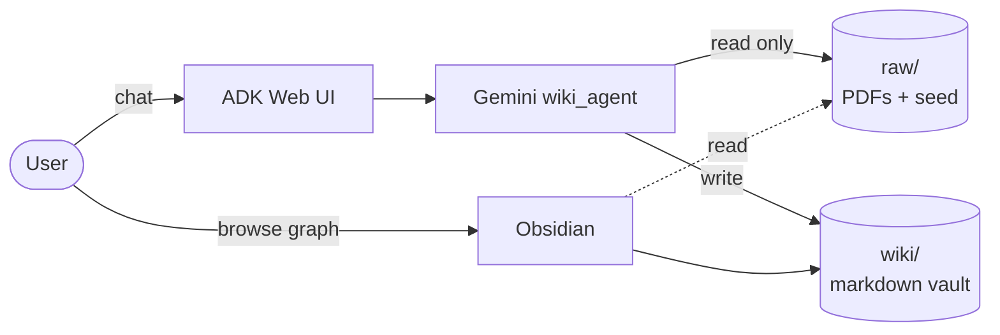

# LLM Wiki Agent Brain

**An autonomous knowledge engine for DistrictNex / Picacity building operations.**  
Turns messy PDFs (manuals, panel schedules, commissioning reports) into a compounding, cited, contradiction-aware Obsidian wiki. Powered by **Google ADK + Gemini**.

> Product = the wiki. Chat = the interface. Every ingest makes the next answer cheaper and better.

---

## Overview

Building operations knowledge is often trapped in PDFs, spreadsheets, and informal notes. The same manuals get re-read for the same questions, baselines drift, and contradictions between commissioning and O&M can go unnoticed until a KPI misfires.

This project is an AI agent that reads those documents once and maintains a structured, interlinked knowledge base. A user (or a downstream Overwatch alert) can ask a question in plain English and get a **wiki-cited** answer with contradictions surfaced.


| Before                               | After                                           |
| ------------------------------------ | ----------------------------------------------- |
| Re-read every PDF per question       | Ingest once, query cheaply                      |
| No shared source of truth            | Obsidian vault, plain markdown, versioned       |
| Contradictions hidden across sources | Flagged explicitly on both pages                |
| KPI baselines drift without notice   | Baselines pinned in entity pages with citations |


**Runtime**: Google Agent Development Kit ([adk.dev](https://adk.dev/)) + Gemini.  
**Storage**: plain markdown files in this repo, browsable in [Obsidian](https://obsidian.md).  
**Pattern**: Karpathy's [LLM Wiki](https://gist.github.com/karpathy/442a6bf555914893e9891c11519de94f); schema adapted from [claude-obsidian](https://github.com/AgriciDaniel/claude-obsidian).

---


## Example query: AHU-3 at 75°F outdoor air

**Question**: *Why is AHU-3 using 20% more power than its baseline at 75°F OA?*

**Expected answer shape from the wiki**:

- 75°F OA is cooling mode — **expected**, not a fault
- Baseline = **16.5 kW** (O&M R2); 20% threshold ≈ **19.8 kW** → FAN-PWR-HIGH investigation
- Ordered checks: filter ΔP → coil fouling → bearings → damper F-34 → VFD
- KPI must be bound to **LP-3 Circuit 7** (fan VFD), not Circuit 9 (controls)
- **Contradiction flagged**: commissioning reported **15.8 kW** — do not use as baseline

The agent cites the wiki pages it read; the pages cite the source documents; the sources are the immutable PDFs.

---


## Architecture

Three layers, one repository:




| Layer         | Directory     | Role                                      | UI                         |
| ------------- | ------------- | ----------------------------------------- | -------------------------- |
| **Sources**   | `raw/`        | Immutable originals (PDFs, seed markdown) | File explorer, Obsidian    |
| **Knowledge** | `wiki/`       | Agent-written interlinked markdown        | Obsidian graph & backlinks |
| **Agent**     | `wiki_agent/` | Gemini + ADK function tools               | ADK Web / CLI / API        |


**Guard rails**: the agent can never write under `raw/`. `wiki/` is the only writable surface. Path escapes are rejected at the tool layer. All facts must cite `(source: filename)`.

---


## Workflow

```mermaid
flowchart LR
  A[Drop PDF into raw manuals] --> B[Ingest via ADK chat]
  B --> C[Agent extracts entities, specs, tables]
  C --> D[Writes wiki pages plus index log hot]
  D --> E[Ask question in ADK Web]
  E --> F[Agent reads hot then index then pages]
  F --> G[Cited answer with contradictions]
  G --> H[Optionally save to wiki sessions]
  H --> I[Browse graph in Obsidian]
```




**Ingest once. Query many times.** The wiki is the durable artifact; chat is transient.

---


## Capabilities


| Capability                                                          | Status                     |
| ------------------------------------------------------------------- | -------------------------- |
| Markdown ingest (`raw/seed/`)                                       | Ready                      |
| PDF ingest (`raw/manuals/`, `raw/reports/`) — local text extraction | Ready                      |
| Entity / concept / source page authoring with citations             | Ready                      |
| Index / append-only log / hot-cache maintenance                     | Ready                      |
| Wiki-cited Q&A with contradiction callouts                          | Ready                      |
| Lint (orphans, dead links, missing units, index drift)              | Ready                      |
| Session save (file Q&A back into vault)                             | Ready                      |
| Obsidian graph view                                                 | Ready (open repo as vault) |
| Path sandbox tests + PDF extraction tests                           | Ready (`pytest -q`)        |
| Portable GitHub PR review (lead-style + optional `docs/tech/`)       | Ready (Actions + `python -m pr_review`) |
| Official tech-docs fetcher agent (`docs_fetcher_agent`)             | Ready (`adk run docs_fetcher_agent`) |
| Scanned-PDF OCR                                                     | Not in v1                  |
| Multi-writer concurrency locks                                      | Not in v1                  |
| REST API deployment (`adk api_server`)                              | Available; not deployed    |


---


## Tech stack

- **Agent framework**: Google [Agent Development Kit](https://adk.dev/) (Python)
- **Model**: Gemini (`gemini-flash-latest`, swappable)
- **PDF**: `pypdf` (local text extraction, no cloud OCR)
- **UI**: [Obsidian](https://obsidian.md) for browsing; ADK Web for chat
- **Storage**: plain markdown + YAML frontmatter, versioned in Git
- **Runtime targets**: local Windows / Linux / Mac; ready for Cloud Run or Vertex Agent Runtime later

---


## Quick start

```powershell
# From this repository root (any machine / OS):
python -m venv .venv
.\.venv\Scripts\Activate.ps1   # Windows; on Unix: source .venv/bin/activate
pip install -r requirements.txt
Copy-Item wiki_agent\.env.example wiki_agent\.env
# Edit wiki_agent\.env and set GOOGLE_API_KEY=...
adk web --no-reload
```

Open [http://127.0.0.1:8000](http://127.0.0.1:8000) → select **wiki_agent**. Then in the chat:

```text
Ingest all files under raw/seed/ without discussion.
Ingest raw/manuals/S24AWN.pdf without discussion.
Why is AHU-3 using 20% more power than its baseline at 75°F outdoor air?
Lint the wiki.
Save that answer as a wiki page.
```

Refresh Obsidian on this folder to see the graph fill in.

**CLI / scripted alternatives**:

```powershell
adk run wiki_agent                     # interactive CLI
python scripts\adk_demo.py             # scripted live demo (requires API key)
pytest -q                              # run sandbox + PDF tests
```

For Overwatch-style integration later:

```powershell
adk api_server                         # REST endpoint
```

---


## Repository layout

```
llm-wiki-agent-brain/
├── raw/                        Immutable sources
│   ├── manuals/                Vendor O&M PDFs (S24AWN, breaker, …)
│   ├── reports/                Commissioning, TAB, fault-report PDFs
│   └── seed/                   Demo markdown (DAEP HVAC + electrical)
├── wiki/                       Agent-written markdown vault
│   ├── index.md                Master catalog
│   ├── log.md                  Append-only operations log
│   ├── hot.md                  Recent-context cache (~500 words)
│   ├── sources/                One page per ingested document
│   ├── entities/               AHU-3, LP-3, F-34, equipment…
│   ├── concepts/               Baselines, modes, faults…
│   └── sessions/               Filed Q&A answers
├── docs/tech/                  Official framework docs for PR review
│   ├── manifest.yaml           Stack → URL + local folder
│   └── <stack>/                Markdown snapshots (ADK, Gemini, pypdf, pytest)
├── pr_review/                  Portable CI PR reviewer (any repo) → inline comments
├── docs_fetcher_agent/         ADK agent: fetch/refresh docs/tech from the manifest
├── wiki_agent/                 Google ADK package
│   ├── agent.py                root_agent (Gemini + tools)
│   ├── prompts.py              Ingest / query / lint / save playbooks
│   └── tools/vault.py          Path-safe file + PDF tools
├── scripts/                    adk_demo · build_sample_pdf (test fixture helper)
├── tests/                      Path sandbox + PDF extraction + PR review
├── AGENTS.md                   Wiki agent rules (source of truth)
├── WIKI.md                     Vault schema conventions
└── .github/workflows/          pr-docs-review.yml (portable PR review)
```

---


## Roadmap

**Now (shipped)** — Markdown + PDF ingest, wiki authoring with citations, cited Q&A, lint, session save, Obsidian graph, sandbox + PDF tests.

**Next** — Larger PDF manuals under `raw/manuals/` (AC + breaker), building-specific panel schedule ingest, sequence-of-operation ingest, per-question evaluation set, pinned model version.

**Later** — REST deployment behind Overwatch, retrieval augmentation for large vaults (BM25 / embeddings), multi-writer locks, scanned-PDF OCR, drawings extraction, live BMS point mapping.

---


## Docs

- [pr_review/README.md](pr_review/README.md) — portable PR reviewer + docs fetcher (any repo)
- [docs/tech/README.md](docs/tech/README.md) — official tech-doc corpus
- [AGENTS.md](AGENTS.md) — wiki agent rules
- [WIKI.md](WIKI.md) — vault conventions
- [Google ADK](https://adk.dev/) — framework
- [Karpathy LLM Wiki](https://gist.github.com/karpathy/442a6bf555914893e9891c11519de94f) — pattern origin
